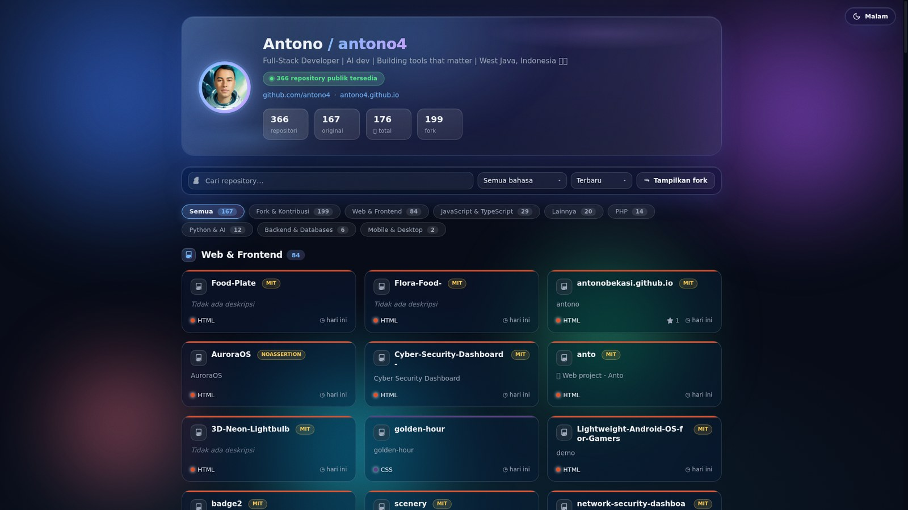
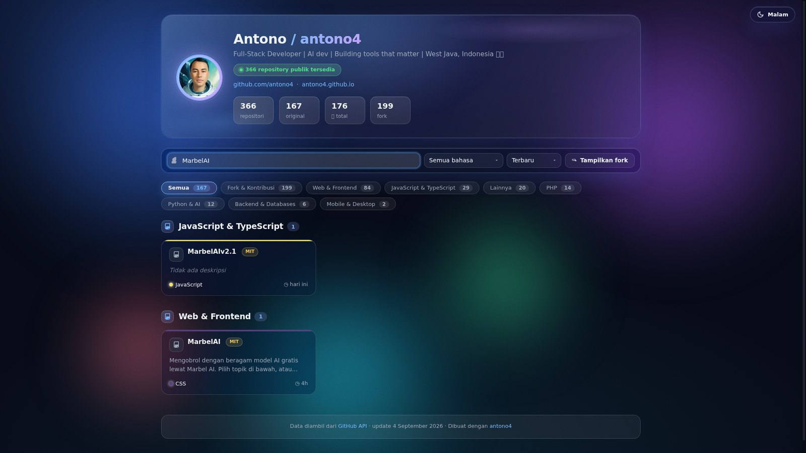
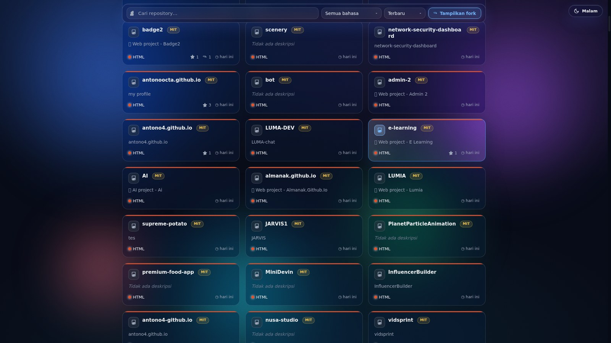

# 🗂️ Grup Repo — Galeri Repository GitHub antono4

Halaman satu-file (`index.html`) yang menampilkan dan **mengelompokkan seluruh repository** dari [github.com/antono4](https://github.com/antono4) — original maupun fork — dalam tampilan galeri yang rapi dan responsif.



## ✨ Fitur

| Fitur | Keterangan |
|---|---|
| 🗂️ **Pengelompokan otomatis** | Repository dikelompokkan berdasarkan kategori: `Web & Frontend`, `JavaScript & TypeScript`, `Python & AI`, `PHP`, `Backend & Databases`, `Mobile & Desktop`, `Lainnya`, dan `Fork & Kontribusi` |
| 🔍 **Pencarian real-time** | Cari repository berdasarkan nama / deskripsi |
| 🎨 **Filter bahasa** | Saring repository berdasarkan bahasa pemrograman (HTML, Python, TypeScript, dll.) |
| ↕️ **Urutkan** | Terbaru · ⭐ Terpopuler · Nama A–Z |
| 🧩 **Chip kategori** | Lompat cepat antar-kelompok repository |
| ⑂ **Toggle fork** | Fork tersembunyi secara default; klik *"Tampilkan fork"* untuk menampilkan 199 fork |
| 🏷️ **Badge & metrik** | Lisensi (MIT, Apache-2.0, dll.), bahasa dengan warna khas GitHub, ⭐ bintang, fork count, dan waktu update |
| 📱 **Responsif** | Grid adaptif dari desktop hingga perangkat mobile — tema gelap khas GitHub |

## 📸 Screenshot

### Pencarian repository


### Fork & Kontribusi


## 🚀 Cara Pakai

Cukup buka `index.html` di browser — **tanpa build, tanpa server, tanpa dependensi**. Semua data repository tertanam sebagai JSON langsung di file-nya.

```bash
# Jika ingin lewat server lokal:
python3 -m http.server 8080
# lalu buka http://localhost:8080
```

> Halaman ini juga siap di-**deploy ke GitHub Pages**, Netlify, Vercel, atau hosting statis apa pun — tinggal upload folder ini.

## 🛠️ Teknologi

- **HTML5 + CSS3** — markup dan styling murni, tema gelap khas GitHub
- **Vanilla JavaScript** — tanpa framework, semua logika (filter, pencarian, pengelompokan, sortir) dijalankan di sisi klien
- **GitHub REST API** — data 366 repository diambil dari `https://api.github.com/users/antono4/repos` (snapshot per-tanggal pembuatan page)

## 📦 Statistik Singkat

| Metrik | Jumlah |
|---|---:|
| Total repository | **366** |
| Repository original | **167** |
| Fork & kontribusi | **199** |
| Total ⭐ | **176** |

## 🔗 Tautan

- Profil GitHub: [github.com/antono4](https://github.com/antono4)
- Halaman utama: [antono4.github.io](https://antono4.github.io)

---

Dibuat oleh **Antono** © 2026 — data diambil dari [GitHub API](https://api.github.com/users/antono4/repos).